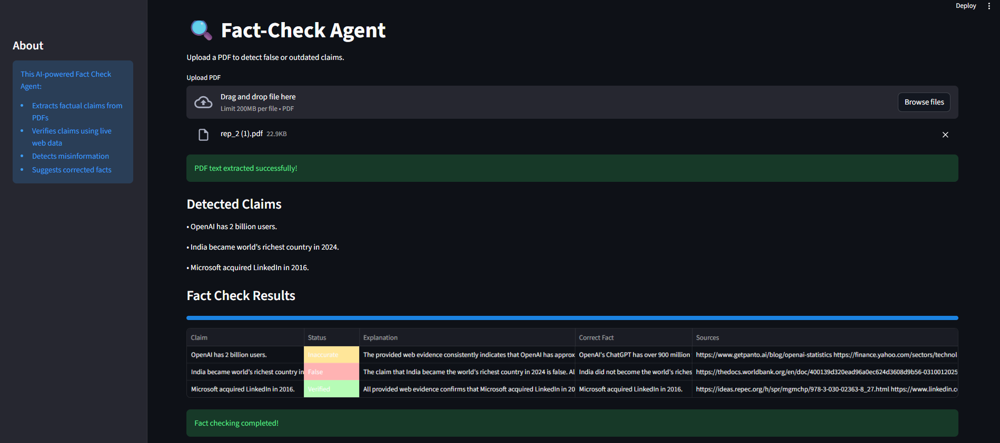

# 🛡️ Fact-Check Agent

An AI-powered web application that automatically verifies factual claims from uploaded PDF documents using live web search and LLM-based reasoning.

## 🚀 Features

- Upload PDF documents
- Extract factual claims automatically
- Detect:
  - False claims
  - Outdated statistics
  - Inaccurate information
- Verify claims using live web data
- Generate corrected factual information
- Display verification results in an interactive dashboard

---

## 🧠 How It Works

1. User uploads a PDF
2. PDF text is extracted using PyMuPDF
3. Claims are identified using Gemini API
4. Claims are verified using Tavily web search
5. AI classifies claims as:
   - Verified
   - Inaccurate
   - False
6. Results are displayed in a structured table

---

## 🛠️ Tech Stack

- Python
- Streamlit
- Gemini API
- Tavily Search API
- PyMuPDF
- Pandas

---

## 📂 Project Structure

```bash
fact-check-agent/
│
├── app.py
├── utils.py
├── requirements.txt
├── README.md
├── .gitignore
└── .env
```

---

## ⚙️ Installation

### 1. Clone Repository

```bash
git clone https://github.com/Rishita-hub
cd fact-check-agent
```

### 2. Install Dependencies

```bash
pip install -r requirements.txt
```

### 3. Add API Keys

Create a `.env` file:

```env
GEMINI_API_KEY=your_gemini_api_key
TAVILY_API_KEY=your_tavily_api_key
```

### 4. Run Application

```bash
streamlit run app.py
```

---

## 🌐 Deployment

The application is deployed on Streamlit Cloud.

Live App Link:
ADD_YOUR_DEPLOYMENT_LINK_HERE

---

## 📸 Demo

Upload PDFs containing:
- statistics
- numerical claims
- financial data
- dates
- technical facts

The app automatically verifies authenticity using live web evidence.

---

## 📌 Example Claims Tested

- “OpenAI has 2 billion users”
- “India became world’s richest country in 2024”

Both claims were correctly flagged as False.

---

## 🔮 Future Improvements

- Source confidence scoring
- Multi-language support
- Downloadable verification reports
- Real-time citation highlighting
- Browser extension integration

---
## 📷 Application Preview



## 👤 Author

Rishita